<div align="center">


## 图文总览

### 论文方法与结果图

<table>
  <tr>
    <td align="center" width="50%">
      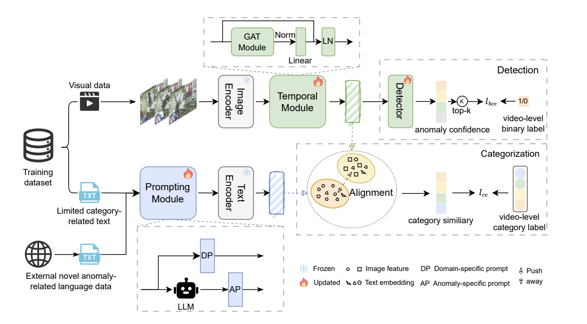
      <br>
      <sub>开放词表 VAD 框架示意</sub>
    </td>
    <td align="center" width="50%">
      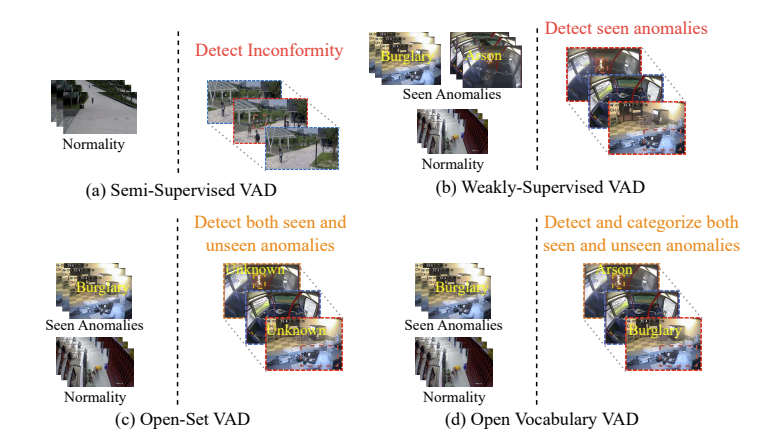
      <br>
      <sub>不同 VAD 范式对比</sub>
    </td>
  </tr>
  <tr>
    <td align="center" width="50%">
      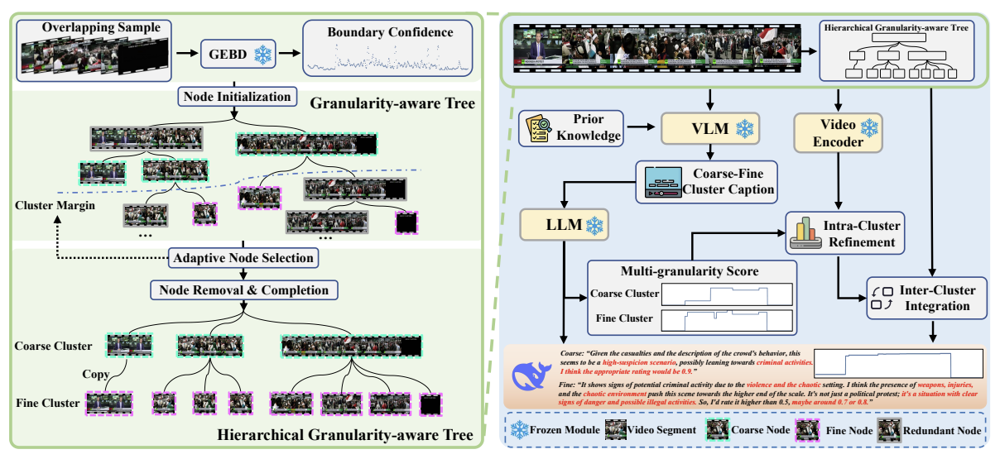
      <br>
      <sub>粒度感知树与多粒度 VAD 流程</sub>
    </td>
    <td align="center" width="50%">
      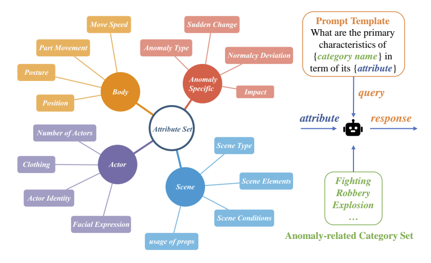
      <br>
      <sub>异常属性提示模板</sub>
    </td>
  </tr>
  <tr>
    <td align="center" width="50%">
      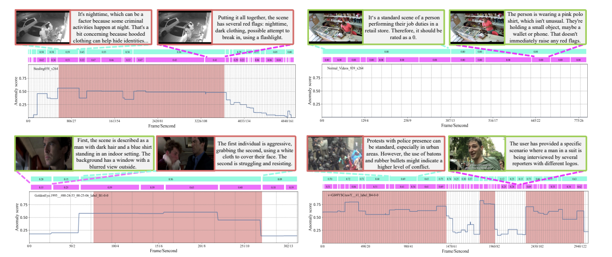
      <br>
      <sub>LLM 推理解释与异常分数示例</sub>
    </td>
    <td align="center" width="50%">
      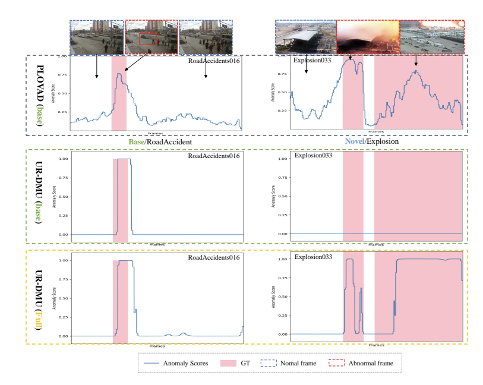
      <br>
      <sub>交通事故与爆炸场景分数对比</sub>
    </td>
  </tr>
</table>

### Demo 界面预览

<details>
  <summary>展开查看 Demo 页面截图</summary>
  <br>
  <table>
    <tr>
      <td align="center" width="33%">
        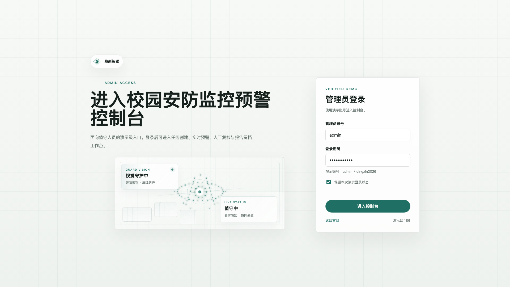
        <br>
        <sub>登录页</sub>
      </td>
      <td align="center" width="33%">
        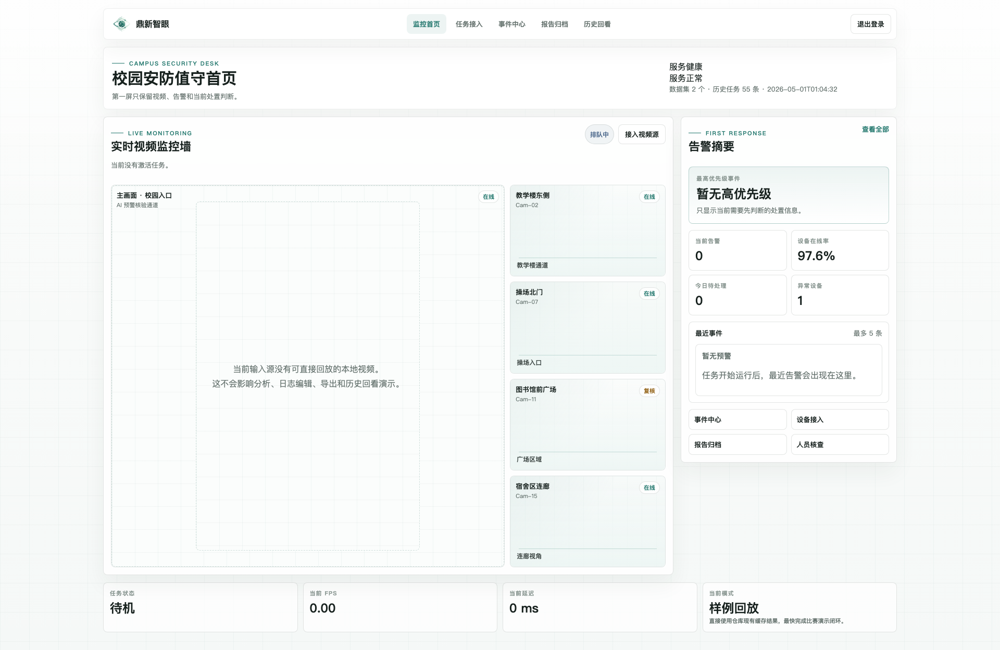
        <br>
        <sub>监控总览页</sub>
      </td>
      <td align="center" width="33%">
        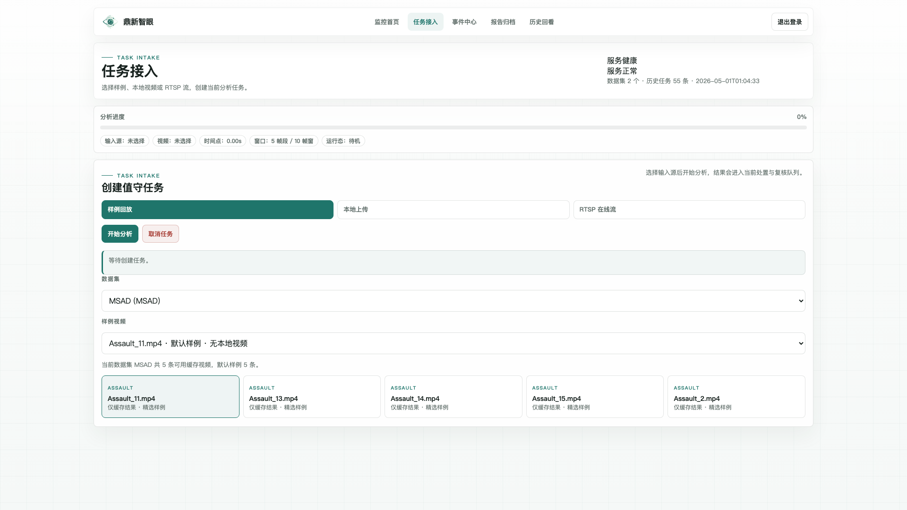
        <br>
        <sub>视频源管理页</sub>
      </td>
    </tr>
    <tr>
      <td align="center" width="33%">
        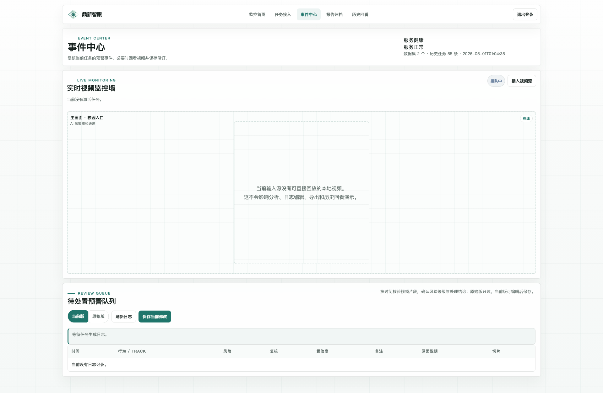
        <br>
        <sub>事件管理页</sub>
      </td>
      <td align="center" width="33%">
        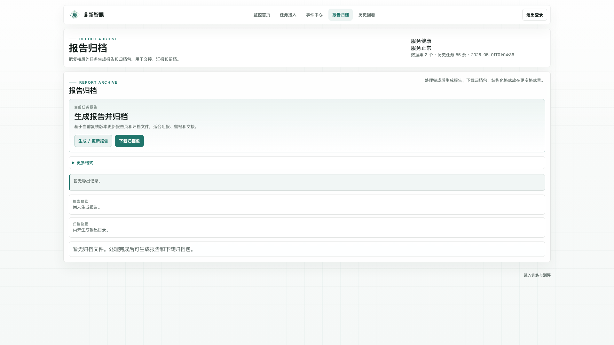
        <br>
        <sub>报告列表页</sub>
      </td>
      <td align="center" width="33%">
        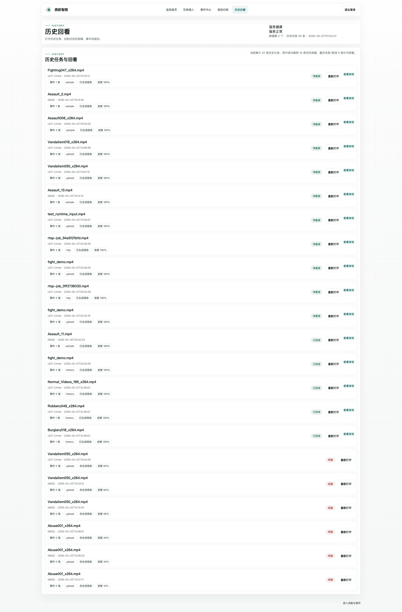
        <br>
        <sub>任务历史页</sub>
      </td>
    </tr>
    <tr>
      <td align="center" width="33%">
        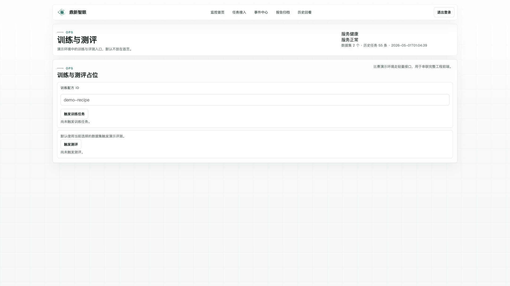
        <br>
        <sub>运维操作页</sub>
      </td>
      <td align="center" width="33%">
        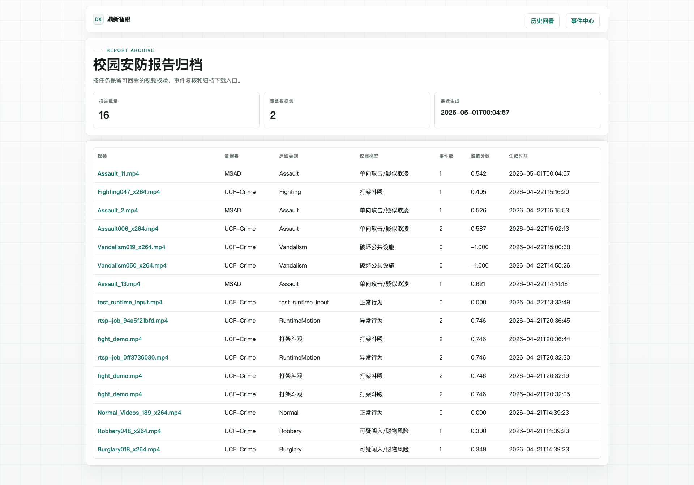
        <br>
        <sub>报告首页</sub>
      </td>
      <td align="center" width="33%">
        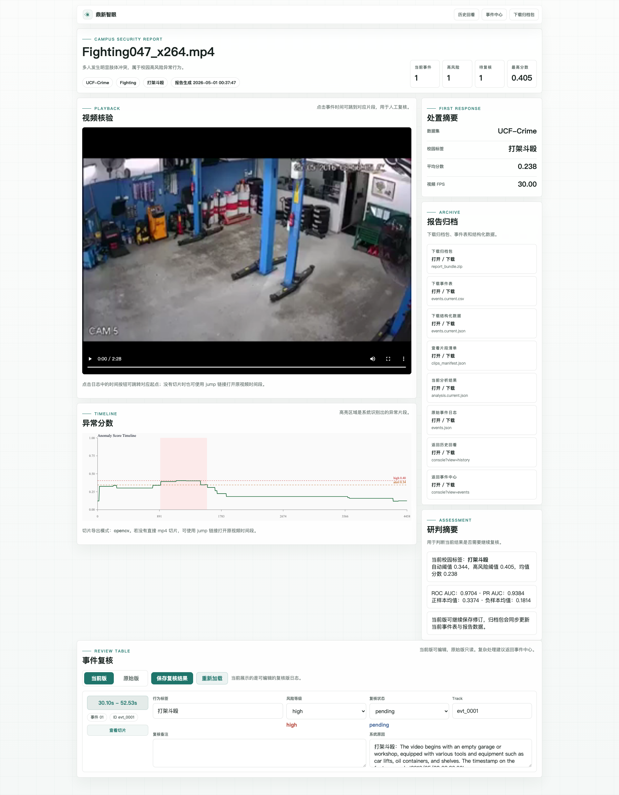
        <br>
        <sub>报告详情页</sub>
      </td>
    </tr>
  </table>
</details>

## 仓库说明

本仓库既包含论文复现主流程，也包含一个基于缓存结果的轻量 Demo 系统。

- `README.md`：当前中文总览文档，包含安装、数据准备、运行流程与图片展示。
- `readme/README.md`：更详细的中文目录结构与模块职责说明。
- `result/`：已发布的中间结果，可用于跳过部分重计算阶段。
- `campus_demo/`：离线报告生成与网页端演示系统。
- `campus_demo_outputs/`：Demo 运行输出，包括报告、历史记录、上传文件与导出结果。

## 数据集准备

`dataset_info/` 已内置 UCF-Crime、XD-Violence（来自 [LAVAD](https://github.com/lucazanella/lavad)）和 MSAD 的标注信息，通常无需额外下载标注文件。

只有读取原始视频的阶段需要你自行准备视频数据。官方数据下载入口如下：

- UCF-Crime: [link](https://www.crcv.ucf.edu/projects/real-world/)
- XD-Violence: [link](https://roc-ng.github.io/XD-Violence/)
- MSAD: [link](https://msad-dataset.github.io/)

以 UCF-Crime 测试集为例，本地目录可组织为：

```text
UCF_CRIME_TEST_VIDEO_DIR (290 videos)
├── Abuse028_x264.mp4
├── Abuse030_x264.mp4
└── ...
```

## 本地大文件准备

为保持仓库轻量，以下目录默认不纳入 Git，需要在本地额外准备：

- `DeepSeek-R1/DeepSeek-R1-Distill-Qwen-7B/`
- `LLaVA-NeXT/LLaVA-Video-7B-Qwen2/`
- `EfficientGEBD/output/`

如果尚未安装 `huggingface_hub`：

```bash
python -m pip install -U huggingface_hub
```

将两个模型目录下载到仓库当前默认使用的位置：

```bash
huggingface-cli download deepseek-ai/DeepSeek-R1-Distill-Qwen-7B \
  --local-dir DeepSeek-R1/DeepSeek-R1-Distill-Qwen-7B

huggingface-cli download lmms-lab/LLaVA-Video-7B-Qwen2 \
  --local-dir LLaVA-NeXT/LLaVA-Video-7B-Qwen2
```

`EfficientGEBD/output/` 也作为本地缓存目录准备。上游 EfficientGEBD 提供的 checkpoint bundle 下载地址如下：

- Google Drive: https://drive.google.com/file/d/1S4M-xnKpjWFGBimcRYzlEDFhDsWQWF_-/view?usp=drive_link

一个可直接参考的下载流程：

```bash
python -m pip install -U gdown
gdown --fuzzy "https://drive.google.com/file/d/1S4M-xnKpjWFGBimcRYzlEDFhDsWQWF_-/view?usp=drive_link"
mkdir -p EfficientGEBD/output
unzip /path/to/downloaded_checkpoint_bundle.zip -d EfficientGEBD/output
```

如果压缩包内部已包含 `output/...` 或 `Kinetics-GEBD/...` 顶层目录，请保持原有结构解压，不要手动改平目录层级。

## 安装

### 1. 克隆仓库并安装根环境

```bash
git clone https://github.com/wenlongli10/VADTree.git
cd VADTree
conda create --name VADTree python=3.10
conda activate VADTree
pip install -r requirements.txt
```

根环境主要覆盖 `HGTree_generation.py`、`ImageBind/imagebind_sim.py`、`refinement_eval.py`、`correlation_eval.py` 以及本地 Demo 工具，不替代各上游子项目所需的完整环境。

### 2. 安装 EfficientGEBD 并准备 GEBD 权重

请参考 [EfficientGEBD](https://github.com/Ziwei-Zheng/EfficientGEBD) 的官方说明完成环境安装。

`EfficientGEBD/output/` 在本仓库中被视为本地下载/缓存目录，不随 Git 管理。可参考上游 `EfficientGEBD/README.md` 给出的 checkpoint 下载地址：

- checkpoint bundle: https://drive.google.com/file/d/1S4M-xnKpjWFGBimcRYzlEDFhDsWQWF_-/view?usp=drive_link

示例：

```bash
python -m pip install -U gdown
gdown --fuzzy "https://drive.google.com/file/d/1S4M-xnKpjWFGBimcRYzlEDFhDsWQWF_-/view?usp=drive_link"
mkdir -p EfficientGEBD/output
unzip /path/to/downloaded_checkpoint_bundle.zip -d EfficientGEBD/output
```

### 3. 安装 LLaVA-Video-7B-Qwen2 并准备 VLM 权重

请参考 [LLaVA-NeXT](https://github.com/LLaVA-VL/LLaVA-NeXT) 完成环境配置。

- LLaVA-Video-7B-Qwen2 checkpoint: [huggingface](https://huggingface.co/lmms-lab/LLaVA-Video-7B-Qwen2)

推荐下载命令：

```bash
huggingface-cli download lmms-lab/LLaVA-Video-7B-Qwen2 \
  --local-dir LLaVA-NeXT/LLaVA-Video-7B-Qwen2
```

### 4. 准备 DeepSeek-R1-Distill-Qwen 权重

`DeepSeek-R1/deepseek_batch_infer.py` 可以复用 LLaVA 的推理环境。

- DeepSeek-R1-Distill-Qwen-14B checkpoint: [huggingface](https://huggingface.co/deepseek-ai/DeepSeek-R1-Distill-Qwen-14B)
- DeepSeek-R1-Distill-Qwen-7B checkpoint: [huggingface](https://huggingface.co/deepseek-ai/DeepSeek-R1-Distill-Qwen-7B)

若按当前默认路径准备 7B 权重，可使用：

```bash
huggingface-cli download deepseek-ai/DeepSeek-R1-Distill-Qwen-7B \
  --local-dir DeepSeek-R1/DeepSeek-R1-Distill-Qwen-7B
```

说明：

- `result/` 中已发布的缓存结果和当前 `campus_demo` 配置沿用了 `DeepSeek-R1-Distill-Qwen-14B` 命名。
- `DeepSeek-R1/deepseek_batch_infer.py` 当前示例默认路径使用的是 `DeepSeek-R1-Distill-Qwen-7B`。
- 请确保你实际使用的 `--ckpt_dir` 与后续输出目录命名保持一致。

## 流程快速开始（以 UCF-Crime 为例）

以下示例以 UCF-Crime 为例，XD-Violence 和 MSAD 仅在路径与数据集配置上有所不同。

### 1. GEBD 边界提取

先完成 EfficientGEBD 环境、GEBD 权重与配置文件准备。

```bash
conda activate EfficientGEBD
cd EfficientGEBD
python GEBD_split100.py \
  --video_dir /path/to/UCF_CRIME_TEST_VIDEO_DIR \
  --resume /path/to/GEBD_MODEL_WEIGHT \
  --config-file /path/to/MODEL_CONFIG
```

典型输出：

```text
VADTree/result/UCF_Crime_test/EGEBD_x2x3x4_r50_eff_split_out_th0.5
├── pred_scenes_th0.5.json
└── scenes_th0.5.json
```

### 2. 构建 HGTree

```bash
cd ..
conda activate VADTree
python HGTree_generation.py \
  --json_path ./result/UCF_Crime_test/EGEBD_x2x3x4_r50_eff_split_out_th0.5/pred_scenes_th0.5.json \
  --threshold kmeans \
  --gamma 0.4
```

典型输出：

```text
VADTree/result/UCF_Crime_test/EGEBD_x2x3x4_r50_eff_split_out_th0.5_peak_dfs_kmeans_1_0.4
├── pred.json
├── dfs_coarse_scenes.json
├── dfs_fine_scenes.json
└── dfs_redundant_scenes.json
```

### 3. 节点级 VLM 描述生成（coarse / fine）

先准备好 LLaVA 环境与 checkpoint。

```bash
conda activate llava
cd LLaVA-NeXT
python infer_VAD.py \
  --pretrained /path/to/LLaVA-Video-7B-Qwen2 \
  --video_root /path/to/UCF_CRIME_TEST_VIDEO_DIR \
  --json_path ../result/UCF_Crime_test/EGEBD_x2x3x4_r50_eff_split_out_th0.5_peak_dfs_kmeans_1_0.4/dfs_coarse_scenes.json

python infer_VAD.py \
  --pretrained /path/to/LLaVA-Video-7B-Qwen2 \
  --video_root /path/to/UCF_CRIME_TEST_VIDEO_DIR \
  --json_path ../result/UCF_Crime_test/EGEBD_x2x3x4_r50_eff_split_out_th0.5_peak_dfs_kmeans_1_0.4/dfs_fine_scenes.json
```

典型输出：

```text
VADTree/result/UCF_Crime_test/EGEBD_x2x3x4_r50_eff_split_out_th0.5_peak_dfs_kmeans_1_0.4/
└── LLaVA-Video-7B-Qwen2_ucf_prior_q_{coarse|fine}/
    └── maxf64_ucf_prior_q_*.json
```

### 4. 节点级 LLM 推理（coarse / fine）

`deepseek_batch_infer.py` 通过 `--video_clip_summary_json` 接收 VLM 生成的描述结果。

```bash
cd ../DeepSeek-R1
python deepseek_batch_infer.py \
  --ckpt_dir /path/to/DeepSeek-R1-Distill-Qwen-14B \
  --video_root /path/to/UCF_CRIME_TEST_VIDEO_DIR \
  --video_clip_summary_json "../result/UCF_Crime_test/EGEBD_x2x3x4_r50_eff_split_out_th0.5_peak_dfs_kmeans_1_0.4/LLaVA-Video-7B-Qwen2_ucf_prior_q_coarse/maxf64_ucf_prior_q_Here is a .json"

python deepseek_batch_infer.py \
  --ckpt_dir /path/to/DeepSeek-R1-Distill-Qwen-14B \
  --video_root /path/to/UCF_CRIME_TEST_VIDEO_DIR \
  --video_clip_summary_json "../result/UCF_Crime_test/EGEBD_x2x3x4_r50_eff_split_out_th0.5_peak_dfs_kmeans_1_0.4/LLaVA-Video-7B-Qwen2_ucf_prior_q_fine/maxf64_ucf_prior_q_Here is a .json"
```

推理输出会写回到对应 caption 目录下，并根据 checkpoint 名称与 prompt 设置自动创建子目录。

### 5. 特征相似度计算（coarse / fine）

```bash
conda activate VADTree
cd ../ImageBind
python imagebind_sim.py \
  --video_summary_json "../result/UCF_Crime_test/EGEBD_x2x3x4_r50_eff_split_out_th0.5_peak_dfs_kmeans_1_0.4/LLaVA-Video-7B-Qwen2_ucf_prior_q_coarse/maxf64_ucf_prior_q_Here is a .json" \
  --video_root /path/to/UCF_CRIME_TEST_VIDEO_DIR

python imagebind_sim.py \
  --video_summary_json "../result/UCF_Crime_test/EGEBD_x2x3x4_r50_eff_split_out_th0.5_peak_dfs_kmeans_1_0.4/LLaVA-Video-7B-Qwen2_ucf_prior_q_fine/maxf64_ucf_prior_q_Here is a .json" \
  --video_root /path/to/UCF_CRIME_TEST_VIDEO_DIR
```

典型输出：

```text
VADTree/result/UCF_Crime_test/EGEBD_x2x3x4_r50_eff_split_out_th0.5_peak_dfs_kmeans_1_0.4/
└── LLaVA-Video-7B-Qwen2_ucf_prior_q_{coarse|fine}/
    └── sim_maxf64_ucf_prior_q_*.pkl
```

### 6. 簇内 refinement 与评估

`refinement_eval.py` 使用的参数名是 `--scores_json`，不是 `--score_json`。

```bash
cd ..
python refinement_eval.py \
  --scores_json "result/UCF_Crime_test/EGEBD_x2x3x4_r50_eff_split_out_th0.5_peak_dfs_kmeans_1_0.4/LLaVA-Video-7B-Qwen2_ucf_prior_q_coarse/<REASONING_DIR>/maxf64_ucf_prior_q_Here is a .json"

python refinement_eval.py \
  --scores_json "result/UCF_Crime_test/EGEBD_x2x3x4_r50_eff_split_out_th0.5_peak_dfs_kmeans_1_0.4/LLaVA-Video-7B-Qwen2_ucf_prior_q_fine/<REASONING_DIR>/maxf64_ucf_prior_q_Here is a .json"
```

脚本会自动加载匹配的 `sim_*.pkl`，并在按相似度配置命名的新目录中写出 `refine_*.json`。

### 7. 跨簇相关性融合与最终评估

```bash
python correlation_eval.py \
  --coarse_scores_json "result/UCF_Crime_test/EGEBD_x2x3x4_r50_eff_split_out_th0.5_peak_dfs_kmeans_1_0.4/LLaVA-Video-7B-Qwen2_ucf_prior_q_coarse/<REFINE_DIR>/refine_maxf64_ucf_prior_q_Here is a .json" \
  --fine_scores_json "result/UCF_Crime_test/EGEBD_x2x3x4_r50_eff_split_out_th0.5_peak_dfs_kmeans_1_0.4/LLaVA-Video-7B-Qwen2_ucf_prior_q_fine/<REFINE_DIR>/refine_maxf64_ucf_prior_q_Here is a .json" \
  --beta 0.2
```

`correlation_eval.py` 会在 coarse 分支下生成新的输出目录，保存最终融合分数与评估结果。

## Campus Demo

仓库内还包含一个轻量演示系统 `campus_demo/`，它基于已有的 VADTree 缓存结果提供离线报告生成与浏览器端查看能力。

当前内置支持的数据集：

- `ucf`
- `msad`

常用命令：

```bash
python campus_demo/app.py list --dataset ucf
python campus_demo/app.py build-report --dataset ucf --video Fighting047_x264.mp4
python campus_demo/app.py build-samples --dataset ucf
python campus_demo/app.py serve --host 127.0.0.1 --port 8000
```

启动 `serve` 后可访问：

```text
http://127.0.0.1:8000/campus_demo/console
```

补充说明：

- 生成的报告、剪辑片段、上传文件、导出包和历史记录默认保存在 `campus_demo_outputs/`。
- 上传分析入口通过 `campus_demo/runtime_pipeline.py` 接入当前运行时流程。
- Demo 中保留了 RTSP 接口层，但当前环境尚未连通实时流推理。

## 参考引用

```bibtex
@inproceedings{li2025vadtree,
  title={VADTree: Explainable Training-Free Video Anomaly Detection via Hierarchical Granularity-Aware Tree},
  author={Li, Wenlong and Xu, Yifei and Rao, Yuan and Wang, Zhenhua and Deng, Shuiguang},
  booktitle={The Thirty-ninth Annual Conference on Neural Information Processing Systems},
  year={2025}
}
```

## 致谢

本仓库基于 [LAVAD](https://github.com/lucazanella/lavad) 进行了扩展与实现，感谢原作者的公开工作。
